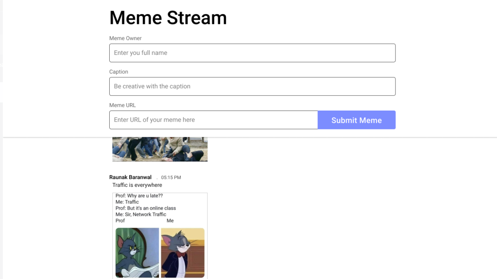
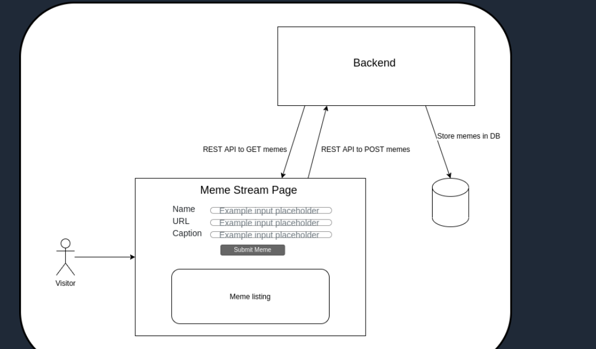

## XMEME

Build a Backend of Meme Stream Page where users can post memes by providing their name, a caption for the meme and the URL for the meme image as input. The page should retrieve and display the latest 100 posted Memes (names + meme images + caption).

This is not a meme generator, but a simple app to pull created memes using their URL and listing them on this page with the user’s name and caption.

A mock up of the application would look like this:

You will be implementing the GET/POST APIs required for the backend and don’t have to implement the front-end.

Usage - 

1. To build the repository - 

From the repository root, 

1. run `./gradlew build test`run the build
2. run `./gradlew bootjar` to create executable jar. The jar will be located inside build directories.

To run inside docker container, use below commands

To build docker image, use the command below - `docker build -t your_tag_name  .`

To run the generated container, use this command - `docker run -p8080:8080 your_tag_name`. This will run the server on 8080 port.. You can change the ports as per your needs. 

License - 
While this repository is licensed under APACHE 2.0 license, It is mandatory for users to share the readme.md and License file along with the changes they do in the contents.
